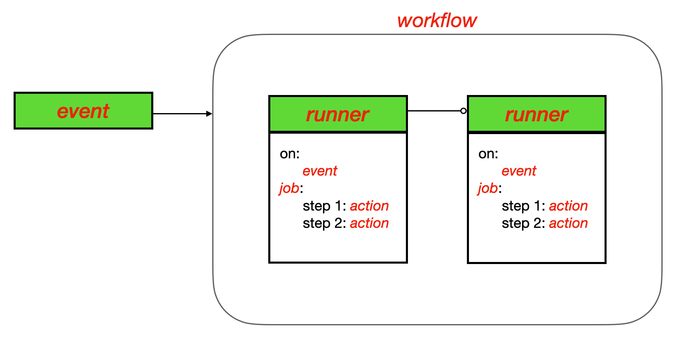
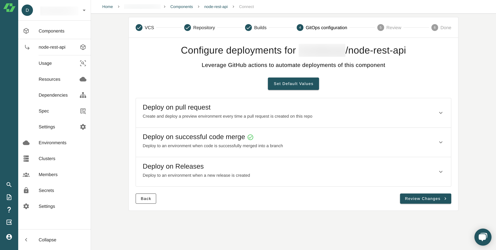

GitHub Actions is a CI/CD platform that automates the steps required to build, test, and deploy code
in a GitHub repository. GitHub released this feature only four years ago, and over 50% of
development teams have already adopted it as their CI/CD platform, according to
[Postman's 2022 State of the API Report](https://www.postman.com/state-of-api/tooling-for-apis-and-development/#tooling-for-apis-and-development).

The beauty of GitHub Actions is that it is native to GitHub and available directly from each
repository, so workflows can authenticate and access your repository seamlessly. Plus, other CI/CD
platforms require additional configuration using webhooks or polling intervals to achieve
bidirectional communication with your GitHub repository, while communication between GitHub and
GitHub Actions _just works_.

{/* truncate */}

You utilize GitHub Actions by defining one or more workflows in a GitHub repository using YAML files
that conform to the GitHub Actions spec. GitHub Actions provides a rich feature set for automating
just about anything! This guide focuses on setting up a
[CI/CD workflow](/blog/2022/10/24/cicd-pipeline-guide/) so you can get started and explore other
elements on your own.

## GitHub Actions key concepts

Understanding a few key concepts will help you get started with GitHub Actions, so let's begin with
an overview. The diagram below shows how the different components interact, and we'll describe each
one in detail.



### Workflow

A workflow describes the steps that GitHub Actions should take to build, test, and deploy your code.
You may create multiple workflows to cover the different stages of your pipeline and then expose
those stages as events that both GitHub and GitHub Actions can act upon. A workflow is triggered
when an event occurs. GitHub Actions provides many
[starter workflows](https://github.com/actions/starter-workflows) you can customize for your own
projects.

### Events

An event is an action that happens against a repository, such as opening or merging a pull request,
running tests, or merging code. GitHub Actions exposes a slew of
[event types](https://docs.github.com/en/actions/using-workflows/events-that-trigger-workflows) to
give you very granular control over your CI/CD pipeline. You add event types to your workflow files,
and when these events occur, they trigger the jobs in your workflow to run.

### Step

A step is an independent task, command, or action called from within a job. It may be a predefined
action or a command run directly on the command line of the machine running the step.

### Actions

Actions are the building blocks of your workflow. You may use actions
[provided by GitHub](https://github.com/marketplace?type=actions), those contributed by the
community, or your own custom actions. Actions may be defined within the same repository as the
workflow that uses it, in another repository, or provided as a Docker image. An action serves as a
reusable step that can be included in multiple jobs and can be used within multiple workflows. A
single job may contain multiple actions such as “build my python code” and “run my unit tests.”
Actions are called from steps, which are part of a job. Not every step runs an action, but every
action is run from a step.

### Jobs

A job is a set of steps that run as part of your workflow. Recall that a step can run a task, a
command, or an action.

### Runner

A runner is a machine, either
[hosted by GitHub](https://docs.github.com/en/actions/using-github-hosted-runners/about-github-hosted-runners)
or self-hosted, that executes the jobs in a workflow. If you specify a GitHub-hosted runner, your
job will run in a new virtual machine (VM) containing the runner application and other tools
necessary for running the actions defined in the job. GitHub hosts runner images for Linux, Windows,
and macOS, and you can
[select from several different OS versions and image sizes](https://docs.github.com/en/actions/using-github-hosted-runners/about-github-hosted-runners#supported-runners-and-hardware-resources).
Each runner contains a set of preinstalled software that you can access, and you may install
additional software using predefined actions.

## Creating a workflow

Now that you understand the key concepts, we'll create a workflow for a Node.js REST API. But first,
what do we want to automate? For a Node.js application, we want to install dependencies, create a
production build, and run tests. The example workflow below triggers those steps anytime someone
pushes to the main branch or opens a pull request against the main branch.

```yml
name: Node.js CI

on:
  push:
    branches: [main]
  pull_request:
    branches: [main]

jobs:
  build:
    runs-on: ubuntu-latest
    strategy:
      matrix:
        node-version: [10.x, 12.x, 14.x, 15.x]
    steps:
      - uses: actions/checkout@v3
      - name: Use Node.js ${{ matrix.node-version }}
        uses: actions/setup-node@v3
        with:
          node-version: ${{ matrix.node-version }}
      - run: npm ci
      - run: npm run build --if-present
      - run: npm test
```

### Events

The first block defines the events that trigger the workflow to run. It specifies the `push` and
`pull_request` events for the `main` branch. We could also include events such as commenting on a
pull request, merging a pull request, and requesting changes in a pull request review. We could also
add other branches by name or pattern. GitHub Actions gives you very granular control over what
events trigger your workflows.

```yml
on:
  push:
    branches: [main]
  pull_request:
    branches: [main]
```

### Jobs

The next section starts the `jobs` block and defines a job named `build`. The `runs-on` property
indicates that this workflow should run on a GitHub-hosted runner called `ubuntu-latest,` which runs
the latest version of the Ubuntu OS. The `strategy.matrix` block allows you to run multiple jobs
using a single job definition. This job will run once for each `node-version` listed. The `matrix`
strategy allows you to specify one or more variables, including the OS the workflow should run on.
GitHub Actions runs up to 256 workflows in parallel to cover every combination of variables defined
in the matrix.

```yml
jobs:
  build:
    runs-on: ubuntu-latest

    strategy:
      matrix:
        node-version: [10.x, 12.x, 14.x, 15.x]
```

### Steps

The `steps` block indicates the steps that should execute each time this workflow runs. As discussed
above, each step specifies an action, and an action can be a predefined action or a command run
directly on the command line of the runner. For example, this workflow uses both predefined actions
and the `npm` executable.

```yml
steps:
  - uses: actions/checkout@v3
  - name: Use Node.js ${{ matrix.node-version }}
    uses: actions/setup-node@v3
    with:
      node-version: ${{ matrix.node-version }}
  - run: npm ci
  - run: npm run build --if-present
  - run: npm test
```

The `uses` property tells GitHub Actions the location of the reusable workflow file where the action
is defined. The first step, `actions/checkout@v`3, lives in a public GitHub repo called `checkout`,
which is owned by `actions`, and we indicate that we wish to use the version tagged `v3`. As you can
probably guess, this action performs a `git checkout` of the repository on the GitHub Actions runner
where this workflow runs. This property could also specify a Docker image or a path to a local file.

```yml
- uses: actions/checkout@v3
```

The `name` property can include any string and is used for labeling and logging. This job will print
the string ‘Use Node.js' followed by the Node.js version of the current instance before running the
steps that follow. This variable will be set at runtime since we are using a matrix strategy to
specify the Node.js versions with which we wish to run this job.

```yml
- name: Use Node.js ${{ matrix.node-version }}
```

The following step uses another public action called `setup-node`, and the `with` property tells it
to run this step for each `node-version` defined in our `strategy` matrix.

```yml
uses: actions/setup-node@v3
  with:
    node-version: ${{ matrix.node-version }}
```

Rather than using predefined actions, the last three steps call directly into the OS of the runner,
using the `npm` executable installed by the `setup-node` action run previously. The first step,
`npm ci`, is similar to `npm install`, except it is meant for automated platforms like continuous
integration to ensure a clean install of dependencies with each run. The next steps run the `build`
and `test` commands defined within the `scripts` section of the `package.json` file for this
repository.

```yml
- run: npm ci
- run: npm run build
- run: npm test
```

## Creating a workflow with Architect[](#creating-a-workflow-with-architect)

With Architect, you can deploy each pull request to a free preview environment to facilitate
testing, early feedback, and iterative development. In fact, Architect will generate the GitHub
Actions workflow file for you when you connect your GitHub repo, import a Docker Compose file, or
create a new component from one of our Starter Projects. You can select the options you want to
include by configuring the deployment options for your project in the Architect UI.



Architect then generates one or more workflow files similar to this one depending on which options
you select.

```yml
name: Architect Preview

on:
  pull_request:
    types:
      - opened
      - reopened
      - closed

env:
  ARCHITECT_EMAIL: ${{ secrets.ARCHITECT_EMAIL }}
  ARCHITECT_PASSWORD: ${{ secrets.ARCHITECT_PASSWORD }}
  ARCHITECT_ACCOUNT: <account-name>

  PLATFORM_NAME: architect # Ex. "architect" to use the managed platform
  COMPONENT_NAME: node-rest-api # Change to the name in your architect.yml
  PREVIEW_TAG: preview-${{ github.event.number }}

jobs:
  architect_create_preview:
    if: github.event.action != 'closed'
    runs-on: ubuntu-latest
    steps:
      - uses: actions/checkout@v3
      - uses: actions/setup-node@v3
        with:
          node-version: '16'
      - uses: crazy-max/ghaction-github-runtime@v2 # Exports internal envs for Github Actions. Required for register caching to work.
      - name: Install Architect CLI
        run: sudo npm install -g @architect-io/cli
      - name: Login to Architect Cloud
        run: architect login
      - name: Register component w/ Architect
        run: architect register -t ${{ env.PREVIEW_TAG }}
      - name: Create env if not exists
        run:
          architect environment:create ${{ env.PREVIEW_TAG }} --platform ${{ env.PLATFORM_NAME }}
          --ttl=1d || exit 0
      - name: Deploy component
        run:
          architect deploy --auto-approve -e ${{ env.PREVIEW_TAG }} ${{ env.COMPONENT_NAME }}:${{
          env.PREVIEW_TAG }}

  architect_remove_preview:
    if: github.event.action == 'closed'
    runs-on: ubuntu-latest
    steps:
      - uses: actions/checkout@v3
      - uses: actions/setup-node@v3
        with:
          node-version: '16'
      - name: Install Architect CLI
        run: sudo npm install -g @architect-io/cli
      - name: Login to Architect Cloud
        run: architect login
      - name: Remove preview environment
        run: architect environment:destroy ${{ env.PREVIEW_TAG }} --auto-approve -f || exit 0x`
```

### Event triggers

Architect generated this workflow based on the options selected in the UI. The workflow will run
when a pull request is opened, reopened, or closed.

```yml
on:
  pull_request:
    types:
      - opened
      - reopened
      - closed
```

### `env` and secrets

This workflow introduces us to the `env` block in GitHub Actions, which sets environment variables
that can be used in later sections. This block references the GitHub secrets store for this
repository, demonstrating how you can store private information and use that information securely at
runtime. It also uses the GitHub Actions variable, `github.event.number`, which GitHub sets at
runtime, providing a unique tag for the name of the preview environment Architect creates.

```yml
env:
  ARCHITECT_EMAIL: ${{ secrets.ARCHITECT_EMAIL }}
  ARCHITECT_PASSWORD: ${{ secrets.ARCHITECT_PASSWORD }}
  ARCHITECT_ACCOUNT: <account-name>

  PLATFORM_NAME: architect # Ex. "architect" to use the managed platform
  COMPONENT_NAME: node-rest-api # Change to the name in your architect.yml
  PREVIEW_TAG: preview-${{ github.event.number }}
```

By using `crazy-max/ghaction-github-runtime@v2`, an action provided by the community in a public
repo, the GitHub runner has access to the environment variables set above at runtime.

```yml
- uses: crazy-max/ghaction-github-runtime@v2 # Exports internal envs for Github Actions. Required for register caching to work.
```

### Conditionals

This workflow creates two separate jobs, `architect_create_preview` and `architect_remove_preview`,
and introduces us to conditionals. Using the GitHub Actions runtime variable, `github.event.action`,
this workflow will run the `architect_create_preview` job only when the event that triggered this
workflow is not a closed pull request. In other words, it will only run when a pull request is
opened or reopened since those are the only other events listed in the event triggers section above.

```yml
architect_create_preview:
  if: github.event.action != 'closed'
```

If the event that triggered this workflow is a closed pull request, the workflow will run the
`architect_remove_preview` job.

```yml
architect_remove_preview:
  if: github.event.action == 'closed'
```

### The `architect_create_preview` job

The `architect_create_preview` job does what the name suggests. It creates a preview environment in
Architect's community cloud and deploys the pull request to the new environment whenever one of the
specified events occurs. This job runs whenever a pull request is opened or reopened but not when a
pull request is closed.

This job performs the following actions:

1. Runs only if the event is not a closed pull request

```yml
if: github.event.action != 'closed'
```

2.  Specifies a GitHub-hosted runner running the latest version of Ubuntu

```yml
runs-on: ubuntu-latest
```

3.  Performs a `git checkout` of the pull request

```yml
- uses: actions/checkout@v3
```

4.  Sets up the Node.js runtime environment using Node.js version 16

```yml
- uses: actions/setup-node@v3
  with:
    node-version: '16'
```

5.  Uses the `crazy-max-ghaction-github-runtim@2` action so the environment variables set above can
    be used

```yml
- uses: crazy-max/ghaction-github-runtime@v2 # Exports internal envs for Github Actions.
```

6.  Installs the Architect CLI

```yml
- name: Install Architect CLI
  run: sudo npm install -g @architect-io/cli
```

7.  Registers the repo as an Architect component, using an environment variable to set the tag

```yml
- name: Register component w/ Architect
  run: architect register -t ${{ env.PREVIEW_TAG }}
```

8.  Creates a preview environment, using an environment variable as the name

```yml
- name: Create env if not exists
  run: |
    architect environment:create ${{ env.PREVIEW_TAG }} --platform ${{ env.PLATFORM_NAME }} --ttl=1d
    || exit 0
```

9.  Deploys the component to the Architect preview environment using values from the environment
    variables

```yml
- name: Deploy component
  run: |
    architect deploy --auto-approve -e ${{ env.PREVIEW_TAG }} ${{ env.COMPONENT_NAME }}:${{
    env.PREVIEW_TAG }}
```

### The `architect_remove_preview` job

The `architect_remove_preview` job does what the name suggests. It removes the preview environment
created in Architect's community cloud. This job runs whenever a pull request is closed.

This job performs the following actions:

1. Runs only if the event is a closed pull request

```yml
if: github.event.action == 'closed'
```

2. Specifies a GitHub-hosted runner running the latest version of Ubuntu

```yml
runs-on: ubuntu-latest
```

3. Performs a `git checkout` of the pull request

```yml
- uses: actions/checkout@v3
```

4. Sets up the Node.js runtime environment using Node.js version 16

```yml
- uses: actions/setup-node@v3
  with:
    node-version: '16'
```

5. Uses the `crazy-max-ghaction-github-runtim@2` action so the environment variables set above can
   be used

```yml
- uses: crazy-max/ghaction-github-runtime@v2 # Exports internal envs for Github Actions.
```

6. Installs the Architect CLI

```yml
- name: Install Architect CLI
  run: sudo npm install -g @architect-io/cli
```

7. Removes the preview environment created by the `architect_create_preview` job

```yml
- name: Remove preview environment
  run: architect environment:destroy ${{ env.PREVIEW_TAG }} --auto-approve -f || exit 0x`
```

You may have noticed that the two jobs duplicate certain steps, such as setting up the Node.js
environment and installing the Architect CLI. Remember that GitHub provisions a new virtual machine
each time it runs a workflow, so the setup steps must be repeated for each independent job in the
workflow.

## Learn more about CI/CD and modern microservices[](#learn-more)

This post only skims the surface of what GitHub Actions is capable of, but it should give you a
starting point for creating workflows to build and deploy your own applications. Check out these
other great blog posts for more information on automating your build and deployment tasks.

[The CI/CD pipeline: A developer's Guild](/blog/2022/10/24/cicd-pipeline-guide/)  
[A Developer's Guide to GitOps](/blog/2021/01/11/gitops-developers-guide/)  
[A Developer's guide to containers](/blog/2022/10/27/containers-developers-guide/)  
[Test Environments: Everything you need to know](/blog/2022/08/09/test-environment-guide/)

As always, feel free to hit us up with comments and suggestions on Twitter at
[@architect_team](https://x.com/@architect_team)!
